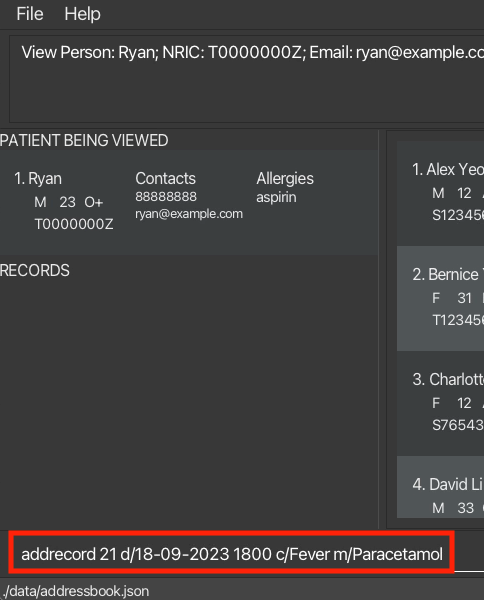
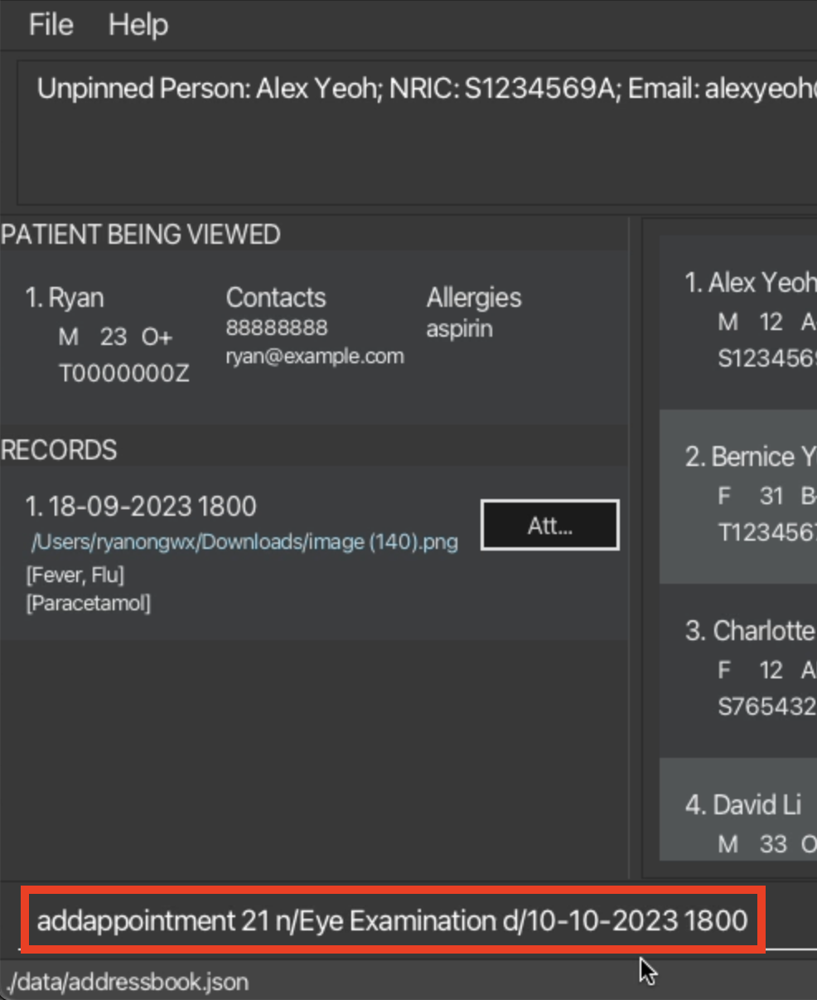
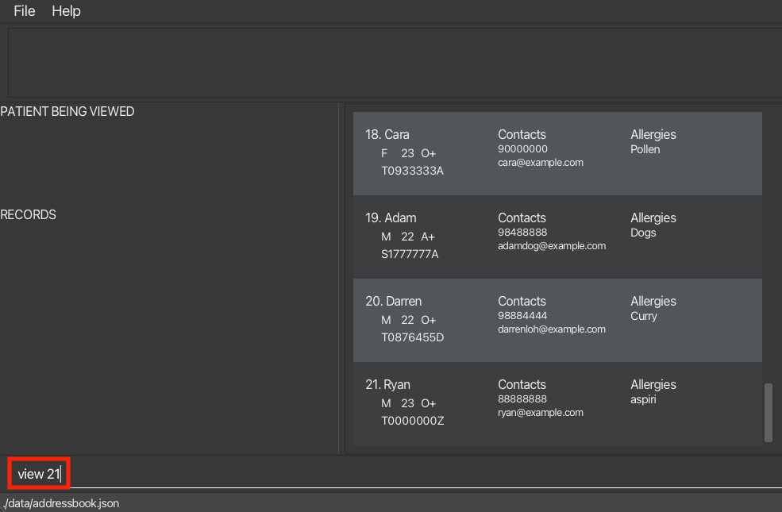
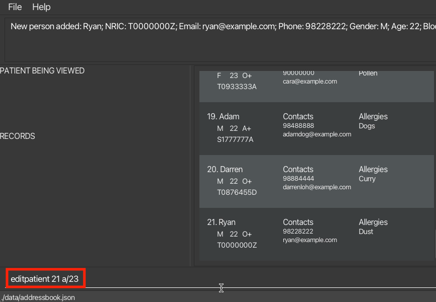
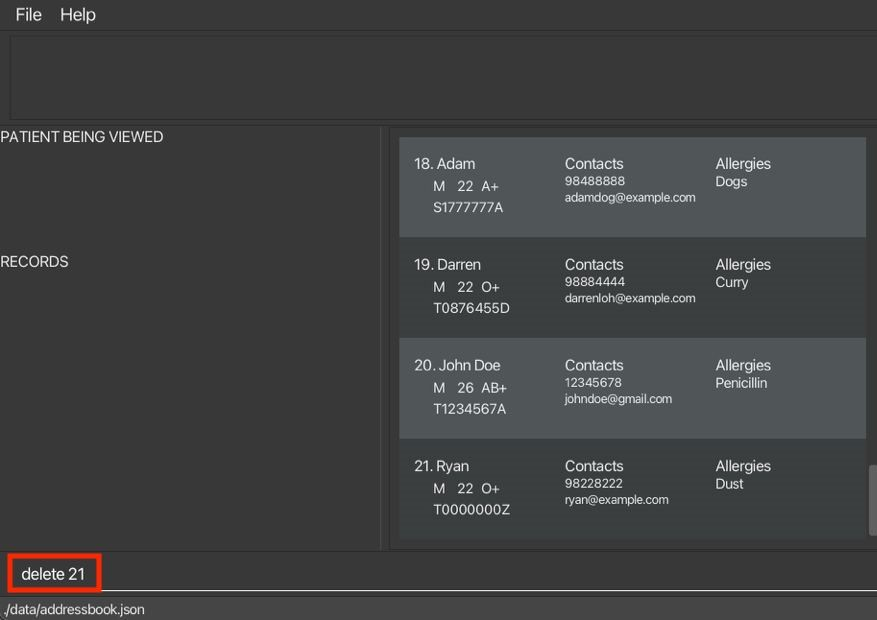
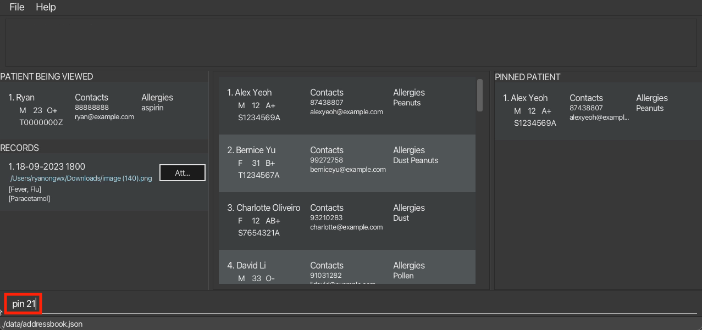

# User Guide

## Welcome to MedBook!

**_Elevate Your Clinic with Advanced Patient Management Solutions_** 

Welcome to MedBook, the revolutionary **desktop application** tailor-made for **doctors** and **medical administrative assistants** in **private clinics**. MedBook is your partner in digitizing patient management and medical records, ensuring efficiency, accessibility, and security.

#### Why Choose MedBook?

With MedBook, experience a new level of convenience and control:

- **Streamlined Patient Management**: With intuitive tools, adding, editing, removing, and saving patient details becomes a task of mere seconds.
- **Integrated Data Handling**: Effortlessly manage patient appointments and medical records from a single, unified platform.
- **Instant Information Access**: Retrieve any required information with speed and precision.
- **Comprehensive Patient Overview**: View patient details, medical history, and upcoming appointments in one comprehensive and easily navigable interface.

#### Unlock the Potential of Digital Healthcare with MedBook

- **Go Digital with Ease**: Transition your clinic to a digital platform effortlessly, backed by features tailored for the healthcare sector's unique needs.
- **Optimized for Speed**: Catering to all skill levels, MedBook's **Command Line Interface (CLI)** and **Graphical User Interface (GUI)** provide options for rapid data entry and user-friendly navigation.
- **Begin Your MedBook Journey**: New to MedBook? Click [here](#quick-start) for a step-by-step guide to revolutionizing your clinic's management system.

---

<!-- * Table of Contents -->

## Table of Contents

<page-nav-print/>

---

## Navigating the User Guide

Welcome to the MedBook User Guide! Our goal is to empower you with the knowledge and confidence to make the most of MedBook's features.

- **Effortless Navigation**: Use the table of contents for seamless navigation between sections.
- **Quick Start for New Users**: If you're new to MedBook, start with the [Quick Start](#quick-start) section to get up and running.
- **Explore Features**: Already familiar with the basics? Dive into the [Features](#features) section to discover all that our application has to offer.

We're here to make your experience as user-friendly as possible. Let's get started!

<u>[Back to Table Of Contents](#table-of-contents)</u>

---

## Quick start

1. **Check Java Installation**:

   - Ensure you have Java `11` or above installed on your computer:

     - [How do I check my version of Java?](#faq)

2. **Download MedBook**:

   - Grab the latest version of MedBook (`medbook.jar`) from our [Github Release](https://github.com/AY2324S1-CS2103T-T12-4/tp/releases).

3. **Set Up Your Workspace**:

   - Choose a folder where you'd like to manage your patient data.
     <box type="tip" seamless>

**Tip**: Create a new folder named `MedBook` for easy organization.

</box>
   - Move `medbook.jar` into the folder as shown below.
     - **Windows Users**:
     - **Mac Users**:

4. **Accessing Terminal**:

   - **Windows Users**:

     - Search for "Terminal" in the Windows search bar and launch it.

   - **Mac Users**:
     - Find **Terminal** in "Utilities" under "Applications". Or, you can use Spotlight Search (Command + Spacebar) and typing "Terminal".

5. **Launch MedBook**:

   - Navigate to to the folder where you have stored `medbook.jar` using the `cd` command
     <box type="tip" seamless>

     **Tip**: Right-click the folder and select `New Terminal at Folder` (**Mac**) or `Open in Terminal` (**Windows**) to instantly navigate to the folder in your **Terminal**!

     </box>

   - Type `java -jar medbook.jar` and hit Enter to start MedBook. 

Once launched, MedBook will look like this:

- **Exploring Further**:
  - Learn more about navigating the GUI [here](#navigating-the-graphical-user-interface-gui).
  - For new users, learn how to use MedBook [here](#medBook-tutorial).
  - For advanced users, view all the available features [here](#features).

<u>[Back to Table Of Contents](#table-of-contents)</u>

---

## Glossary

### Definitions

Here are some definitions of the terms used throughout this user guide.

| **Term**                       | **Definition**                                                                                                                                                                           |
| ------------------------------ | ---------------------------------------------------------------------------------------------------------------------------------------------------------------------------------------- |
| Graphical User Interface (GUI) | The GUI allows you to interact with the application through things you can click, instead of typing commands. It also provides visual display for information stored in the application. |
| Command Line Interface (CLI)   | The CLI is a way of interacting with the application using typed text commands.                                                                                                          |
| Command                        | A Command is a textual input that users type into the Command Line Interface to interact with the application.                                                                           |
| Parameter                      | A parameter is a specific piece of information or data that you provide to a Command in a Command Line Interface to customize the Command's action.                                      |

<u>[Back to Table Of Contents](#table-of-contents)</u>

---

## Navigating the GUI

**Main Window**:

Here is a brief summary of the GUI components in MedBook.

| **Name of component** | **Description**                                                                                          |
| --------------------- | -------------------------------------------------------------------------------------------------------- |
| Menu Bar              | Displays the drop down menus for MedBook, such as **File** and **Help**                                  |
| Message Display Box   | Display the message output for every command. It can either can be an error or success message           |
| Patient Card          | Contains information of the patient such as name, age, and contact information                           |
| Patient List          | Displays a list of Patient Cards                                                                         |
| Patient Being Viewed  | The Patient Card of the patient currently being viewed                                                   |
| Record Card           | Contains information of the medical record including date and time, condition, and prescribed medication |
| Medical Records List  | Displays a list of Record Cards belonging to the Patient Being Viewed                                    |
| Pinned Patient List   | Displays a list of Patient Cards of pinned patients                                                      |
| Command Input Box     | A text box which allows users to input commands                                                          |

**Appointment Window**

| **Name of component** | **Description**                                                                                                                                              |
| --------------------- | ------------------------------------------------------------------------------------------------------------------------------------------------------------ |
| Appointment Card      | Contains information of the appointment including name, date and time and NRIC                                                                               |
| Appointment List      | Displays a list of Appointment Cards                                                                                                                         |
| Calendar              | Presents appointments on their specific dates. Each date shows the abbreviated `NAME` of up to the **first two** appointments from the **Appointment List**. |
| Previous Button       | Shifts the calendar to the previous month                                                                                                                    |
| Next Button           | Shifts the calendar to the next month                                                                                                                        |

<u>[Back to Table Of Contents](#table-of-contents)</u>

---

## MedBook Tutorial

1. **Starting MedBook**:

   - Launch the MedBook application. You may refer to [here](#quick-start).

    <box type="info" seamless>

   **Info**: Upon starting, MedBook will display some sample data to help you get familiar.

    </box>

2. **Opening the Help Window**:
   - Let us try opening the **Help Window**. Type `help` in the Command Input Box and press Enter.
   - A **Help Window**, similar to the image below, will appear, listing all available commands.    
     Please refer to the [Features](#features) section for a more detailed explanation of the commands.
3. **Adding a New Patient**:
   - Now, let us try adding a new patient. Type in `addpatient n/John Doe i/A0000000B e/johndoe@gmail.com p/12345678 g/M a/26 bt/AB+ al/Penicillin` and press Enter.
   - The Message Display Box will confirm the successful addition. 
4. **Practice Adding Patients**:
   - Experiment by adding a few more patients to MedBook on your own!
5. **Adding a Medical Record**:
   - Now, let us try adding a medical record to a patient. Type in `addrecord 3 d/18-09-2023 1800 c/Fever m/Paracetamol` and press Enter.
   - This will add a new medical record to the third patient shown in the **Patient List**.
   - The Message Display Box will confirm the successful creation.  
6. **Add More Medical Records**:
   - Try creating additional medical records for other patients in MedBook!
7. **Viewing Patient Records**:
   - Let us view the medical records of the first patient. Type in `view 1` and press Enter.
   - If no medical records were added for the first patient, you will see an empty **Medical Record List** as shown.
      

Congratulations! You are now ready to explore MedBook on your own. Experiment with different features in the following section and discover the potential of MedBook!

<u>[Back to Table Of Contents](#table-of-contents)</u>

---

## Features

<box type="info" seamless>

**Notes about the command format:** 

- **Upper Case Words**: Words in `UPPER_CASE` indicate parameters to be supplied by the user. 

  - Example: in `addpatient n/NAME`, `NAME` is a parameter which can be used as `add n/John Doe`.

- **Optional Items**: Square brackets `[ ]` denote optional elements. 

  - Example: `n/NAME [al/ALLERGIES]` can be entered as either `n/John Doe al/Pencillin` or just `n/John Doe`.

- **Repeated Use**: Ellipsis `…` after an item means it can be used multiple times. 

  - Example: `[al/ALLERGIES]…​` can be used as `al/Pencillin`, `al/Pollen al/Dust` or not at all.

- **Flexible Parameter Order**: The order of parameters in a command can vary. 

  - Example: Both `n/NAME p/PHONE_NUMBER` and `p/PHONE_NUMBER n/NAME` are valid.

- **Extraneous parameters**: Additional parameters for commands that do not require them (such as `help`, `list`, and `exit`) will be ignored. 

  - Example: `help 123` will be processed just as `help`.

- **Unique Identifiers**: **Must be a positive integer** like 1, 2, 3, …​

  - `PATIENTID`: The unique identification for a patient shown in the **Patient List**. 

  - `RECORDID`: The unique identification for a medical record shown in the displayed **Medical Record List** of a specific patient. 

  - `APPOINTMENTID`: The unique identification for an appointment shown in the displayed **Appointment List**. 

  - `PINNEDID`: The unique identification for a patient shown in the displayed **Pinned Patient List**. 

</box>

### Parameters

| FIELD        | PREFIX | CONSTRAINTS                                                                                           |
| ------------ | ------ | ----------------------------------------------------------------------------------------------------- |
| `NAME`       | n      | Alphanumeric characters, dashes, dots and spaces only                                                 |
| `NRIC`       | i      | Starts with a letter, followed by seven digits, and ends with a letter. Letters are case-insensitive. |
| `EMAIL`      | e      | Must follow the format **local-part@domain**                                                          |
| `GENDER`     | g      | Either **M** (Male) or **F** (Female)                                                                 |
| `PHONE`      | p      | A sequence of at least 3 digits long                                                                  |
| `AGE`        | a      | A non-negative integer                                                                                |
| `BLOODTYPE`  | bt     | Must be one of the following: **A-**, **A+**, **B-**, **B+**, **AB-**, **AB+**, **O-**, **O+**        |
| `ALLERGY`    | al     | Alphanumeric characters only                                                                          |
| `DATETIME`   | d      | Must follow the format **dd-MM-yyyy HHmm**                                                            |
| `CONDITION`  | c      | Alphanumeric characters, dashes and spaces                                                            |
| `MEDICATION` | m      | Alphanumeric characters, dashes and spaces                                                            |

  <box type="info" seamless>

**Notes for `NAME` format:**  

- If the patient's name contains the `/` character, use the `-` character instead. For example, use `s-o` instead of `s/o`.
  </box>

<box type="info" seamless>

**Notes for `NRIC` format:**  

- If the patient does not have an NRIC, eg. foreigners, a placeholder NRIC which is not valid such as `A1234567A` can be used instead.
  </box>

<box type="info" seamless>

**Notes for `EMAIL` format:**  

1. The **local-part** should only contain alphanumeric characters and these special characters: `+`, `_`, `.`, `-`. The **local-part** may not start or end with any special characters.  

2. This is followed by an `@` and then a **domain** name. The **domain** name is made up of **domain** labels separated by periods.  

The **domain** name must:  

- end with a **domain** label at least 2 characters long  

- have each **domain** label start and end with alphanumeric characters  

- have each **domain** label consist of alphanumeric characters, separated only by hyphens, if any.
  </box>

<box type="info" seamless>

**Notes for `ALLERGY` format:**  

- Allergies that consist of multiple words should be consolidated into a single word with each word's initial letter capitalized. For example, use `RedMeat` instead of `Red Meat`.
  </box>

<u>[Back to Table Of Contents](#table-of-contents)</u>

### Viewing help : `help`

<box type="tip" seamless>

  **Tip**:If you get stuck while using MedBook, use the help command to get a quick overview of all commands!

</box>

Opens/focuses the **Help Window** displaying all commands.

Format: `help`

<u>[Back to Table Of Contents](#table-of-contents)</u>

### Adding a patient: `addpatient`

<box type="tip" seamless>

**Tip**:Wants to add a new patient?  Try out the `addpatient` command!

</box>

Adds a new patient to the system.

Format: `addpatient n/NAME i/NRIC e/EMAIL p/PHONE g/GENDER a/AGE bt/BLOODTYPE [al/ALLERGY]...`

- Adds a patient with information including: `NAME`, `NRIC`, `EMAIL`, `GENDER`, `PHONE`, `AGE`, `BLOODTYPE`, `ALLERGY`.

Example:

`addpatient n/John Doe i/T1234567A e/johndoe@gmail.com p/12345678 g/M a/26 bt/AB+ al/Penicillin`
Adds a **Male** patient named **John Doe** whose NRIC is **T1234567A** , **26** years old, has **AB+** Blood Type, and is allergic to **Penicillin**.
His email and phone number is **johndoe@gmail.com** and **12345678**, respectively.

Screenshots:

<u>[Back to Table Of Contents](#table-of-contents)</u>

### Adding a medical record: `addrecord`

<box type="tip" seamless>

**Tip**:Don't know how to add a medical record to the patient? Check out the `addrecord` command!

</box>

Adds a new medical record to the system.

Format: `addrecord PATIENTID d/DATETIME c/CONDITIONS... m/MEDICATIONS...`

- Adds a medical record to the patient with the corresponding `PATIENTID`.  

- Duplicate entries for `CONDITIONS` and `MEDICATIONS` are allowed and will be considered as separate entries.
  - `addrecord 1 d/10-11-2023 1800 c/Flu c/Flu m/Ibuprofen m/Ibuprofen` will store **[Flu, Flu]** and **[Ibuprofen, Ibuprofen]** for `CONDITIONS` and `MEDICATIONS`, respectively.

Example:

- `addrecord 3 d/18-09-2023 1800 c/Fever m/Paracetamol`
  Adds a medical record to the patient with the `PATIENTID` of **3**.
  The patient visited the clinic on **September 18th, 2023** at **6:00PM** with a **Fever** and was prescribed **Paracetamol**.

Screenshots:

<u>[Back to Table Of Contents](#table-of-contents)</u>

### Adding an appointment: `addappointment`

<box type="tip" seamless>

**Tip**:Wants to add an appointment? The `addappointment` command is here to help you!

</box>

Adds a new appointment to the system.

Format: `addappointment PATIENTID n/NAME d/DATETIME`

- Adds an appointment to the patient with the corresponding `PATIENTID`.

Example:

- `addappointment 2 n/Eye Examination d/10-10-2023 1800` Adds an `Eye Examination` to the patient with the `PATIENTID` of **2**. The appointment is schedueld for the **10th of October 2023** at **6:00PM**.

Screenshots:

<u>[Back to Table Of Contents](#table-of-contents)</u>

### Viewing patient medical records: `view`

<box type="tip" seamless>

**Tip**:Don't know how to display medical records? Easily view them by `view` command!

</box>

Displays the medical records of a specific patient.

Format: `view PATIENTID`

- The medical records of the patient with the corresponding `PATIENTID` will be displayed on screen in the **Medical Record List**.  

- The corresponding patient's **Patient Card** will be displayed in the **Patient Being Viewed** section.  

Examples:

- `view 2` displays the medical records of the patient with the `PATIENTID` of **2**. The medical records will be displayed in the **Medical Record List** and patient information will be in the **Patient Being Viewed** section.

    <box type="info" seamless>

  **Info**: The PATIENTID in the Patient Being Viewed section will display **1**. If you wish to perform commands on the patient, use the PATIENTID displayed in the Patient List.

    </box>

Screenshots:

<u>[Back to Table Of Contents](#table-of-contents)</u>

### Viewing appointments: `viewappointment`

<box type="tip" seamless>

**Tip**:Wish to know about the upcoming appointments? Simply type in `viewappointment`! 

</box>

Opens/focuses the **Appointment Window**.

Format: `viewappointment`

<u>[Back to Table Of Contents](#table-of-contents)</u>

### Editing a patient: `editpatient`

<box type="tip" seamless>

**Tip**:Just entered a wrong detail of the patient? Use `editpatient` to correct it!

</box>

Edits the details of an existing patient.

Format: `editpatient PATIENTID PREFIX/NEWVALUE...`

- Edits the details of the patient with the corresponding `PATIENTID`.  

- Acceptable fields: `NAME`, `EMAIL`, `PHONE`, `GENDER`, `AGE`, `BLOODTYPE`, `ALLERGY`.  
  <box type="info" seamless>

  **Note**: `NRIC` cannot be edited.

  </box>

- Existing values in the respective fields will be updated to the `NEWVALUE`.  

- Multiple entries of `ALLERGY` are allowed i.e `editpatient 1 al/Seafood al/Dust`.  
  <box type="info" seamless>

  **Note**: When editing `ALLERGY`, the existing allergies of the patient will be removed i.e adding of allergies is not cumulative.

  </box>

Examples:

- `editpatient 1 e/johndoe_updated@gmail.com` Edits the `EMAIL` of the patient with the `PATIENTID` of **1** to **johndoe_updated@gmail.com**.  

- `editpatient 2 p/92345678` Edits the `PHONE` of the patient with the `PATIENTID` of **2** to **92345678**.  

- `editpatient 3 al/aspirin` Edits the `ALLERGY` of the patient with the `PATIENTID` of **3** to**aspirin**.  

- `editpatient 2 p/92345678 al/aspirin` Edits the `PHONE` and `ALLERGY` of the patient with the `PATIENTID` of **2** to **92345678** and **aspirin**, respectively.  

Screenshots:

<u>[Back to Table Of Contents](#table-of-contents)</u>

### Editing a medical record: `editrecord`

<box type="tip" seamless>

**Tip**:Spotted an error in the medical record? Fret not, the `editrecord` is here!

</box>

Edits the details of an existing medical record.

Format: `editrecord PATIENTID/RECORDID PREFIX/NEWVALUE...`

- Edits the details of the medical record with the corresponding `RECORDID` of the patient with the corresponding `PATIENTID`.  

- Acceptable fields : `DATETIME`, `CONDITION`, `MEDICATION`.  

- Existing values in the respective fields will be updated to the `NEWVALUE`.  

- Multiple entries of `CONDITION` and `MEDICATION` are allowed i.e `editrecord 1/1 c/Flu c/Fever m/Panadol m/Ibuprofen`.  

Examples:

- `editrecord 1/1 d/25-10-2023 1200` Edits the `DATETIME` of the medical record with the `RECORDID` of **1** of the patient with the `PATIENTID` of **1** to **25-10-2023 1200**.  

- `editrecord 1/1 c/Headache c/Flu` Edits the `CONDITION` of the medical record with the `RECORDID` of **1** of the patient with the `PATIENTID` of **1** to **Headache, Flu**.  

- `editrecord 1/1 c/Headache m/Paracetamol` Edits the `CONDITION` and `MEDICATION` of the medical record with the `RECORDID` of **1** of the patient with the `PATIENTID` of **1** to **Headache** and **Paracetamol**, respectively.  

<u>[Back to Table Of Contents](#table-of-contents)</u>

### Locating patients by keywords: `search`

<box type="tip" seamless>

**Tip**:Cannot find the patient you're looking for? If you remember one of his/her details, `search` will help you find him/her!

</box>

Searches for patients with details containing the corresponding `KEYWORD`.

Format: `search KEYWORD [MOREKEYWORDS]...`

- The search is not case-sensitive. e.g **Penicillin** will match **penicillin**.  

- The order of the keywords does not matter. e.g. **Hans Bo** will match **Bo Hans**.

- Patients matching at least one keyword will be returned. e.g. **Hans Bo** will return **Hans Gruber**, **Bo Yang**.  

- Patients with detail that are not exactly the same as the `KEYWORD` searched will not appear. e.g. **Han** will not return **Hans**.  

<box type="info" seamless>

**Note**: The details of the patient's medical records will not be searched.

</box>

<box type="tip" seamless>

**Tip**: Maximize the efficiency of the `search` command to quickly locate patients. It's perfect for filtering patient lists - for instance, identifying patients with specific allergies.

</box>

Examples:

- `search Alex` Will display patients with **Alex** in their details.  

- `search Alex M` Will display patients with **Alex** or **M** in their details.

Screenshots:

<u>[Back to Table Of Contents](#table-of-contents)</u>

### Locating medical records by keywords: `searchrecord`

<box type="tip" seamless>

**Tip**:Feeling frustrated by the huge amount of records? Use `searchrecord` to locate the ones you need!

</box>

Searches for medical records of the Patient Being Viewed with details containing the corresponding `KEYWORD`.

Format: `searchrecord KEYWORD [MOREKEYWORDS]...`

- The search is not case-sensitive. e.g **Penicillin** will match **penicillin**.  

- Medical records matching at least one **KEYWORD** will be returned. e.g. **Mild Fever** will return **Mild Flu**, **High Fever** 

- Medical records with detail that are not exactly the same as the **KEYWORD** searched will not appear. e.g. **Head** will not return **Headache**.  

  <box type="important" seamless>

  **Important**: The **Patient Being Viewed** section should not be empty. Otherwise `searchrecord` command will not return any medical records.

  </box>

Examples:

- `searchrecord Penicillin` Will display medical records of the Patient Being Viewed with **Penicillin** in their details.  

- `searchrecord Fever Cough` Will display medical records of the Patient Being Viewed with **Fever** or **Cough** in their details.  

- `searchrecord 19-10-2023` Will display medical records of the Patient Being Viewed with **19-10-2023** in their details.  

<u>[Back to Table Of Contents](#table-of-contents)</u>

### Listing all patients: `list`

<box type="tip" seamless>

**Tip**:Just used `search` command and don't know how to get back? Simply type `list` to display all patients!

</box>

Shows a list of all patients.

Format: `list`

- **All** patients will be shown in the **Patient List**.

<box type="tip" seamless>

**Tip**: The `list` command allows you to easily view all the patients in the **Patient List**. For instance, after you've used the `search` command to find specific patients, you can use the `list` command to gather all the patients conveniently!

</box>

<u>[Back to Table Of Contents](#table-of-contents)</u>

### Deleting a patient: `delete`

<box type="tip" seamless>

**Tip**:Wants to remove irrelevant patient? `delete` is here to help you!

</box>

Deletes an existing patient from the system.

Format: `delete PATIENTID`

- Deletes the patient with the corresponding `PATIENTID`.

Example:

- `delete 2` Deletes the patient with the `PATIENTID` of **2**.

Screenshots:

<u>[Back to Table Of Contents](#table-of-contents)</u>

### Deleting a medical record: `deleterecord`

<box type="tip" seamless>

**Tip**: The record is faulty and you want to remove it? Enter `deleterecord` to get rid of it!

</box>

Deletes an existing medical record from the system.

Format: `deleterecord PATIENTID/RECORDID`

- Deletes the medical record with the corresponding `RECORDID` from the patient with the corresponding `PATIENTID`.

Example:

- `deleterecord 2/1` Deletes the medical record with the `RECORDID` of **2** from the patient with the `PATIENTID` of **1**.

<u>[Back to Table Of Contents](#table-of-contents)</u>

### Deleting an appointment: `deleteappointment`

<box type="tip" seamless>

**Tip**:A patient cannot attend an appointment? Use `deleteappointment` to cancel it!

</box>

Deletes an appointment from the system.

Format: `deleteappointment APPOINTMENTID`

- Deletes the appointment with the corresponding `APPOINTMENTID`.

Example:

- `deleteappointment 1` Deletes the appointment with the `APPOINTMENTID` of **1**.

<u>[Back to Table Of Contents](#table-of-contents)</u>

### Pinning a Patient: `pin`

<box type="tip" seamless>

**Tip**: A patient requires follow-up? `pin` can help you remember to contact them!

</box>

Pins an existing patient.

Format: `pin PATIENTID`

- Pins the patient with the corresponding `PATIENTID` to the **Pinned Patient List**.

Example:

- `pin 2` Pins the patient with the `PATIENTID` of **2** to the **Pinned Patient List**.

Screenshots:

<u>[Back to Table Of Contents](#table-of-contents)</u>

### Unpinning a Patient: `unpin`

<box type="tip" seamless>

**Tip**:A patient no longer needs extra attention? Easily remove them from *Pinned Patient List* by `unpin` command!

</box>

Unpins a pinned patient.

Format: `unpin PINNEDID`

- Unpins the patient with the corresponding `PINNEDID` from the **Pinned Patient List**.

Examples:

- `unpin 2` Unpins the patient with the `PINNEDID` of **2** from the **Pinned Patient List**.

<u>[Back to Table Of Contents](#table-of-contents)</u>

### Attaching files to a patient's medical record

<box type="tip" seamless>

**Tip**:A patient's report just comes out? The `attach file` feature can help you keep documents in an organised manner!

</box>

Attach local files to a patient's medical record by clicking on the **Attach** button located within each **Record Card**.

<box type="warning" seamless>

**Caution**:

- Refrain from deleting/relocating the local file. If necessary, re-attach the new file after relocation/deletion.
- Ensure that you have selected a default launcher for the selected file type.

</box>

Screenshots:

<u>[Back to Table Of Contents](#table-of-contents)</u>

### Exiting the program: `exit`

Exits the program.

Format: `exit`

<u>[Back to Table Of Contents](#table-of-contents)</u>

### Saving the data

MedBook data is saved in the `data` folder automatically after any command that changes the data. This ensures the safety of your data. When MedBook is restarted, the data is loaded back into the application automatically.

<u>[Back to Table Of Contents](#table-of-contents)</u>

### Editing the data file

MedBook data is saved automatically as a JSON file located in `[jar file location]/data/medbook.json`. The file can be edited directly to make changes to MedBook data.

<box type="warning" seamless>

**Caution**: Only advanced users are encouraged to make changes to the data file as wrong data formatting may result in the application not working as intended.

</box>

<u>[Back to Table Of Contents](#table-of-contents)</u>

---

## FAQ

**Q**: How do I check my java version? 
**A**: Open a **Terminal** and enter `java -version`. If you do not have Java installed, you can download it [here](https://www.oracle.com/java/technologies/downloads/#java11).

**Q**: How do I transfer my data to another Computer? 
**A**: Install the app in the other computer and copy the `data` folder over to the folder of the installed jar file in the other computer.

**Q**: I just entered a very long allergy and the format of *Patient Card* goes messy.
**A**: MedBook do not accept extreme inputs. We will try to amend this issue in next iteration.
<u>[Back to Table Of Contents](#table-of-contents)</u>

---

## Known issues

1. **When using multiple screens**, if you move the application to a secondary screen, and later switch to using only the primary screen, the GUI will open off-screen. The remedy is to delete the `preferences.json` file created by the application before running the application again.

<u>[Back to Table Of Contents](#table-of-contents)</u>

---

## Command Summary

| Action                     | Format, Examples                                                                                                                                                                                    |
| -------------------------- | --------------------------------------------------------------------------------------------------------------------------------------------------------------------------------------------------- |
| **Help**                   | `help`                                                                                                                                                                                              |
| **Add Patient**            | `addpatient n/NAME i/NRIC e/EMAIL p/PHONE g/GENDER a/AGE bt/BLOODTYPE [al/ALLERGY]...​`   e.g., `addpatient n/John Doe i/T1234567A e/johndoe@gmail.com p/12345678 g/M a/26 bt/AB+ al/Penicillin` |
| **Add Medical Record**     | `addrecord PATIENTID d/DATETIME c/CONDITION... m/MEDICATION...`  e.g., `addrecord 2 d/10-10-2020 1900 c/Fever m/Painkiller`                                                                      |
| **Add Appointment**        | `addappointment PATIENTID n/NAME d/DATETIME`  e.g., `addappointment 2 n/Eye Exam d/10-10-2020 1900`                                                                                              |
| **List**                   | `list`                                                                                                                                                                                              |
| **View Medical Records**   | `view PATIENTID`  e.g., `view 2`                                                                                                                                                                 |
| **View Appointments**      | `viewappointment`                                                                                                                                                                                   |
| **Edit Patient**           | `editpatient PATIENTID PREFIX/NEWVALUE...`  e.g.,`editpatient 1 e/johndoe_updated@gmail.com`                                                                                                     |
| **Edit Medical Record**    | `editrecord PATIENTID/RECORDID PREFIX/NEWVALUE...`  e.g.,`editrecord 1/1 d/25-10-2023 1200`                                                                                                      |
| **Search Patients**        | `search KEYWORD [MOREKEYWORDS]...`  e.g., `search James`                                                                                                                                         |
| **Search Medical Records** | `searchrecord KEYWORD [MOREKEYWORDS]...`  e.g., `searchrecord Headache`                                                                                                                          |
| **Delete Patient**         | `delete PATIENTID`  e.g., `delete 3`                                                                                                                                                             |
| **Delete Medical Record**  | `deleterecord PATIENTID/RECORDID`  e.g., `deleterecord 2/1`                                                                                                                                      |
| **Delete Appointment**     | `deleteappointment APPOINTMENTID`  e.g., `deleteappointment 1`                                                                                                                                   |
| **Pin**                    | `pin PATIENTID`  e.g., `pin 2`                                                                                                                                                                   |
| **Unpin**                  | `unpin PINNEDID`  e.g. `unpin 2`                                                                                                                                                                 |
| **Exit**                   | `exit`                                                                                                                                                                                              |

<u>[Back to Table Of Contents](#table-of-contents)</u>
